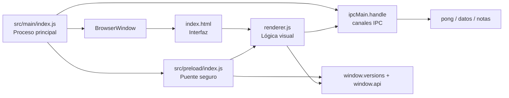

# my-electron-app

Aplicación de escritorio construida con [Electron](https://www.electronjs.org/) y [Electron Forge](https://www.electronforge.io/).

## Descripción

Este proyecto es una app de ejemplo con una ventana principal que carga un archivo HTML local, expone información básica del entorno de ejecución y prueba comunicación entre el proceso principal y el renderizador mediante IPC.

## Estructura del proyecto

```text
my-electron-app/
├─ forge.config.js
├─ package.json
├─ assets/              → iconos (tray, app)
└─ src/
   ├─ main/index.js     → proceso principal (ventanas, menú, tray, IPC)
   ├─ preload/index.js  → puente seguro (contextBridge)
   ├─ renderer/         → UI (index.html + renderer.js)
   ├─ shared/ipc.js     → constantes de canales IPC
   └─ db/database.js    → acceso a SQLite (node:sqlite)
```

### Archivos principales

- `src/main/index.js`: proceso principal de Electron. Crea la ventana, el menú nativo, el tray y registra los canales IPC.
- `src/preload/index.js`: puente seguro entre el proceso principal y el renderizador. Expone `window.versions` y `window.api`.
- `src/renderer/renderer.js`: lógica del renderizador. Lee `versions`, usa `window.api` y pinta información en la interfaz.
- `src/renderer/index.html`: interfaz visual principal de la app.
- `src/shared/ipc.js`: única fuente de verdad de los nombres de canales IPC.
- `src/db/database.js`: capa de datos con SQLite (solo proceso principal).
- `forge.config.js`: configuración de Electron Forge, empaquetado, makers y publicación en GitHub.
- `package.json`: scripts, metadatos y dependencias.

## Funcionamiento

1. Al ejecutar la app, Electron inicia `src/main/index.js`.
2. `src/main/index.js` crea una ventana de `BrowserWindow`, el menú y el tray.
3. `src/preload/index.js` expone una API mínima al renderer.
4. `src/renderer/renderer.js` consume esa API y actualiza la interfaz.
5. Los canales IPC cubren: ping, contador (estado en main), selector de archivos, notificaciones nativas y notas persistidas en SQLite.

## Arquitectura

La app sigue la arquitectura típica de Electron con un proceso principal, un proceso de renderizado y un archivo de preload como puente seguro entre ambos.



### Flujo de comunicación

- `src/main/index.js` crea la ventana y registra los canales IPC (constantes en `src/shared/ipc.js`).
- `src/preload/index.js` expone solo las APIs necesarias en `window`.
- `src/renderer/renderer.js` consume esas APIs y actualiza la interfaz.

## Scripts disponibles

- `npm run start`: arranca la aplicación en modo desarrollo.
- `npm run package`: genera el paquete de la app.
- `npm run make`: crea instaladores o distribuibles según la configuración de Forge.
- `npm run publish`: publica los distributables en GitHub Releases.

## Requisitos

- Node.js instalado.
- Dependencias instaladas con `npm install`.
- Para publicar en GitHub, se necesita la variable de entorno `GITHUB_TOKEN` con permisos para subir releases.

## Publicación

La configuración de publicación está en `forge.config.js` y apunta al repositorio GitHub del proyecto. Para publicar correctamente, define el token antes de ejecutar el comando:

```bash
set GITHUB_TOKEN=tu_token
npm run publish
```

En PowerShell:

```powershell
$env:GITHUB_TOKEN="tu_token"
npm run publish
```

### Flujo de auto-updates

La app usa `update-electron-app` (solo cuando `app.isPackaged`), que revisa GitHub Releases buscando una versión más nueva que la del `package.json`:

- El release debe estar **publicado** (no en draft): `draft: false` en `forge.config.js` hace que `npm run publish` publique el release de inmediato.
- En Windows (Squirrel), el update necesita el archivo `latest.yml` que Forge sube junto al instalador; en macOS usa ZIP firmados y en Linux DEB/RPM.
- Bump de versión: sube `version` en `package.json` (ej. `1.0.0` → `1.0.1`) antes de `npm run publish`; sin bump la app instalada no detecta cambios.
- Cada plataforma solo publica sus propios makers (zip es solo darwin), así que para un release multi-plataforma conviene ejecutar `npm run publish` desde cada sistema o usar un pipeline de CI.

## Notas técnicas

- La app usa `contextBridge` en el preload, que es la forma recomendada de exponer API al renderer.
- El archivo `src/renderer/index.html` incluye una política básica de seguridad con `Content-Security-Policy`.
- El proyecto está configurado como `commonjs` en `package.json`.
- La persistencia usa `node:sqlite` (integrado en Node 24) solo desde el proceso principal; la base vive en `app.getPath('userData')`.
- Auto-updates configurados con `update-electron-app` (requiere un release publicado en GitHub, no un draft).

## Guía de arquitectura, Electron y SQLite

Esta sección resume una forma sólida de trabajar con este proyecto cuando crezca. La idea es mantener la interfaz ligera, la lógica sensible en el proceso principal y la persistencia de datos en una capa separada.

### Arquitectura recomendada

La estructura más estable para una app Electron pequeña o mediana es separar responsabilidades por capas.

```text
src/main/index.js      -> ciclo de vida, ventanas, IPC, acceso a sistema
src/preload/index.js   -> puente seguro entre main y renderer
src/renderer/renderer.js -> interfaz, eventos y consumo de datos
src/db/database.js     -> persistencia local (SQLite) controlada desde main
src/shared/ipc.js      -> constantes de canales IPC compartidas
```

#### Roles de cada capa

- `src/main/index.js`: crea la ventana, controla el cierre de la aplicación y administra operaciones privilegiadas.
- `src/preload/index.js`: expone una API mínima y segura al renderizador usando `contextBridge`.
- `src/renderer/renderer.js`: maneja la experiencia visual y llama a funciones expuestas por `preload.js`.
- `src/db/database.js`: capa única de acceso a SQLite; solo la usa el proceso principal.

### Cómo funciona Electron en este proyecto

Electron combina Node.js y Chromium. En este repositorio ya se ve el flujo básico:

1. Electron arranca en `src/main/index.js`.
2. El main crea la ventana principal con `BrowserWindow`.
3. La ventana carga `src/renderer/index.html` como interfaz local.
4. `src/preload/index.js` expone una API limitada a `window`.
5. `src/renderer/renderer.js` consume esa API y actualiza el contenido.
6. Los canales IPC (constantes en `src/shared/ipc.js`) comunican ambos procesos: ping, contador, archivos, notificaciones y notas.

### Buenas prácticas para Electron

- Mantén `nodeIntegration` desactivado en el renderer.
- Usa `contextIsolation` activado y comunica el renderer solo por `preload.js`.
- Expón funciones específicas, no objetos con acceso amplio al sistema.
- Valida toda entrada que viaje por IPC.
- Reserva al proceso principal las tareas sensibles: archivos, base de datos, credenciales y accesos al sistema.
- Mantén una Content Security Policy estricta en la interfaz.

### Persistencia con SQLite

La capa `src/db/database.js` ya implementa persistencia local con **`node:sqlite`** (el SQLite integrado en Node 24, sin módulos nativos): abre la base en `app.getPath('userData')`, aplica migraciones simples y expone operaciones de notas. La UI de notas (agregar/eliminar) la consume vía IPC.

#### Cuándo usar SQLite

- Cuando necesitas guardar datos sin depender de internet.
- Cuando la app debe funcionar rápido y con una sola base local.
- Cuando quieres consultas estructuradas y transacciones.

#### Dónde ubicar el acceso a datos

La recomendación es no abrir SQLite desde el renderizador. Lo más seguro es:

- abrir la base desde `src/main/index.js` o desde un módulo de acceso a datos que solo use el proceso principal;
- exponer operaciones concretas en `preload.js`;
- consumir esas operaciones desde `renderer.js` sin tocar la base directamente.

#### Flujo recomendado

1. La app inicia y el proceso principal abre o crea la base de datos.
2. Se ejecutan migraciones o creación de tablas si hace falta.
3. El renderizador pide datos mediante IPC.
4. El proceso principal lee o escribe en SQLite.
5. El resultado vuelve al renderizador para mostrarlo en la UI.

#### Qué guardar en SQLite

- Datos de negocio: tareas, registros, formularios, inventario, notas.
- Estados persistentes: configuración del usuario, ventanas, filtros y preferencias.
- Historial o auditoría si tu aplicación lo necesita.

#### Buenas prácticas con SQLite

- Usa una sola capa de acceso a datos.
- Centraliza las consultas para no duplicar lógica.
- Define migraciones desde el inicio.
- No construyas SQL concatenando texto sin validar.
- Mantén la base en una ruta de datos de usuario, no dentro del código fuente.

### Instalación y distribución

La instalación de una app Electron depende del sistema operativo objetivo. En este proyecto ya existe soporte con Electron Forge.

#### Flujo de desarrollo

1. Instala dependencias con `npm install`.
2. Ejecuta la app con `npm run start`.
3. Verifica el comportamiento de la ventana y el IPC.

#### Empaquetado

- `npm run package`: prepara la aplicación para distribución.
- `npm run make`: genera instaladores o binarios según la plataforma.
- `npm run publish`: publica los artefactos en GitHub Releases.

#### Instaladores por plataforma

- Windows: Squirrel.
- macOS: ZIP.
- Linux: DEB y RPM.

#### Publicación segura

La publicación usa GitHub Releases y requiere `GITHUB_TOKEN` en el entorno. No conviene dejar tokens hardcodeados en el repositorio.

### Estructura del proyecto

Esta estructura ya está implementada en el repo. Si crece más, se puede seguir ampliando igual:

```text
src/
├─ main/
├─ preload/
├─ renderer/
├─ shared/
└─ db/
```

- `main/`: ventanas, menús, tray, IPC y lógica del sistema.
- `preload/`: API segura expuesta al renderer.
- `renderer/`: componentes visuales y estado de la interfaz.
- `shared/`: utilidades, tipos o validadores comunes (ej. constantes IPC).
- `db/`: conexión, consultas y migraciones de SQLite.

### Resumen práctico

- Electron te da la interfaz de escritorio.
- `src/preload/index.js` te protege de exponer demasiado.
- `src/db/database.js` resuelve la persistencia local.
- Electron Forge te resuelve empaquetado y publicación.
- Separar responsabilidades desde el inicio evita que la app se vuelva difícil de mantener.
